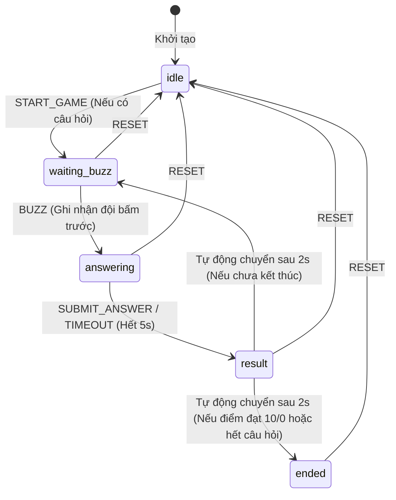

# PHÂN TÍCH THIẾT KẾ XSTATE MACHINE VÀ HỆ THỐNG PHÍM BẤM - MILESTONE 2

## 1. TỔNG QUAN (EXECUTIVE SUMMARY)
Báo cáo này nghiên cứu và thiết kế chi tiết hệ thống quản lý trạng thái (State Machine) sử dụng **XState v5** và hệ thống xử lý sự kiện bàn phím (Keyboard Event Prevention) cho Game Kéo Co Kiến Thức (Knowledge Tug of War). 
Thiết kế tập trung giải quyết các bài toán cốt lõi:
- Xây dựng sơ đồ chuyển trạng thái chặt chẽ theo đặc tả PRD.
- Chặn đứng hoàn toàn hiện tượng tranh chấp quyền bấm chuông (Race Conditions) giữa 2 đội.
- Ngăn chặn triệt để hành vi spam phím (Spamming) và chặn hành vi cuộn trang mặc định của phím Space mà không làm ảnh hưởng trải nghiệm người dùng ngoài game.
- Tích hợp nhẹ nhàng vào Preact thông qua cơ chế `createActor` thuần của XState v5 mà không cần phụ thuộc vào thư viện bổ sung `@xstate/preact`.

---

## 2. KHẢO SÁT CODEBASE HIỆN TẠI (MILESTONE 1)
Sau khi phân tích mã nguồn được tạo từ Milestone 1, chúng tôi ghi nhận cấu trúc hiện tại như sau:
1. **`src/main.tsx`**: Khởi tạo Custom Element `<knowledge-tug-of-war>` sử dụng Shadow DOM. Nhúng và truyền các thuộc tính `theme`, `default-questions` (parse sang JSON) và `host` (Web Component instance) vào Preact App.
2. **`src/app.tsx`**: Dựng khung giao diện tĩnh với đầy đủ 4 khu vực:
   - **HUD Area**: Điểm số và phím tắt của 2 đội (Team 1: Space, Team 2: Enter).
   - **Main Game Arena**: Hiển thị câu hỏi và lưới đáp án 2x2.
   - **Visual Kéo Co**: Thanh đo lực kéo (tỷ lệ 50-50 ban đầu) kèm dải ruy băng ở giữa.
   - **Controls Dashboard**: Nút Import/Export dữ liệu câu hỏi dạng JSON.
3. **`src/state-machine.ts`**: Bản phác thảo sơ bộ (Stub) của XState Machine với các state `idle`, `waiting_buzz`, `answering`, `result`, `ended`. Cấu trúc sự kiện và context ban đầu đã được khai báo nhưng chưa hoàn thiện các hành động (actions) và lính canh (guards) xử lý logic thực tế.
4. **`src/crypto.ts`**: Chứa hàm `verifyAnswer` bất đồng bộ sử dụng Web Crypto API (SHA-256) để so sánh đáp án được chọn với hash đã mã hóa cùng chuỗi salt.

---

## 3. THIẾT KẾ CHI TIẾT XSTATE MACHINE (V5)
Để quản lý toàn bộ vòng đời của một lượt chơi, XState Machine cần được thiết kế với các cấu phần sau:

### 3.1. Cấu trúc Context (TugOfWarContext)
Context lưu trữ dữ liệu động của game:
- `questions`: Mảng danh sách câu hỏi hiện tại.
- `currentQuestionIndex`: Vị trí câu hỏi hiện tại (0-indexed).
- `timer`: Thời gian đếm ngược trả lời (mặc định 5 giây).
- `score`: Lực kéo hiện tại của 2 đội (bắt đầu từ `{ team1: 5, team2: 5 }`, tổng luôn bằng 10).
- `activeTeam`: Đội giành được quyền trả lời (`'team1' | 'team2' | null`).
- `buzzWinner`: Đội đập chuông nhanh nhất (`'team1' | 'team2' | null`).
- `importError`: Thông báo lỗi nếu import JSON thất bại.

### 3.2. Danh sách Sự kiện (TugOfWarEvent)
- `IMPORT_QUESTIONS`: Tải bộ câu hỏi mới.
- `START_GAME`: Khởi động trò chơi.
- `BUZZ`: Kích hoạt khi có đội nhấn phím đập chuông (`team1` hoặc `team2`).
- `SUBMIT_ANSWER`: Gửi đáp án được chọn và kết quả kiểm tra (`isCorrect`).
- `TIMER_TICK`: Giảm thời gian đếm ngược mỗi giây.
- `RESET`: Đưa game về trạng thái ban đầu.

### 3.3. Thiết kế Trạng thái và Chuyển dịch (State Transitions)
Sơ đồ hoạt động được thiết kế khép kín và tự động hóa cao:



#### Mô tả chi tiết logic chuyển trạng thái:
1. **`idle`**: Chờ giáo viên tải đề thi. Khi sự kiện `START_GAME` được kích hoạt, hệ thống kiểm tra lính canh `hasQuestions`. Nếu thỏa mãn, chuyển sang `waiting_buzz` đồng thời reset chỉ số câu hỏi và đưa điểm số về tỷ lệ cân bằng `5 - 5`.
2. **`waiting_buzz`**: Hiển thị câu hỏi nhưng vô hiệu hóa 4 đáp án. Lắng nghe phím bấm từ 2 đội. Khi nhận sự kiện `BUZZ`, gán `activeTeam` và `buzzWinner` vào context, đồng thời chuyển ngay lập tức sang `answering`.
3. **`answering`**: Bật sáng 4 nút đáp án cho đội active. Khởi chạy một Actor đếm ngược thời gian (`timerActor`). Mỗi giây Actor này gửi sự kiện `TIMER_TICK`:
   - Nếu `timer > 1`: Trừ `timer` đi 1 đơn vị.
   - Nếu `timer === 1`: Trừ điểm của đội active do lỗi hết giờ (Timeout), gán `timer = 0` và chuyển sang `result`.
   - Nếu nhận được `SUBMIT_ANSWER` trước khi hết giờ: Dừng Actor đếm ngược, tính toán lại lực kéo dựa trên kết quả trả lời (`isCorrect`) và chuyển sang `result`.
4. **`result`**: Hiển thị đáp án đúng/sai và cập nhật trực quan thanh kéo co. Sử dụng tính năng trễ thời gian (`after: 2000`) của XState v5 để tự động phân luồng sau 2 giây:
   - Nếu lính canh `isGameOver` trả về `true` (một trong hai đội đạt lực kéo `10` hoặc đã đi hết bộ câu hỏi): Chuyển sang `ended`.
   - Ngược lại: Tăng `currentQuestionIndex` lên 1, xóa thông tin đội active và quay về `waiting_buzz`.
5. **`ended`**: Hiển thị đội chiến thắng chung cuộc (đội có điểm lực kéo bằng 10 hoặc đội có điểm cao hơn khi hết câu hỏi). Cung cấp nút Reset để quay lại trạng thái `idle`.

---

## 4. THIẾT KẾ HỆ THỐNG PHÍM BẤM VÀ NGĂN CHẶN RACE CONDITIONS
Hệ thống phím bấm bàn phím đóng vai trò quyết định trong việc đảm bảo tính công bằng và mượt mà của game.

### 4.1. Giải quyết Tranh chấp Đập chuông (Race Conditions)
Trong các trò chơi đối kháng trực tiếp, hiện tượng 2 người chơi nhấn nút gần như đồng thời là rất phổ biến. State Machine giải quyết triệt để vấn đề này nhờ nguyên lý chuyển trạng thái nguyên tử (Atomic State Transition):
1. Khi máy trạng thái ở `waiting_buzz`, sự kiện `BUZZ` là sự kiện duy nhất được đăng ký để chuyển sang `answering`.
2. Ngay khi sự kiện `BUZZ` đầu tiên được gửi đến (ví dụ từ Đội 1 bấm Space), XState sẽ xử lý nó trong cùng một microtask, cập nhật trạng thái máy sang `answering` một cách đồng bộ.
3. Khi máy đã ở trạng thái `answering`, sự kiện `BUZZ` tiếp theo (ví dụ từ Đội 2 bấm Enter muộn hơn vài mili giây) sẽ bị máy trạng thái **bỏ qua hoàn toàn** vì trạng thái `answering` không cấu hình bộ lắng nghe sự kiện `BUZZ`.
4. Do đó, việc lockout (khóa) đội bấm sau xảy ra tức thời ở tầng Logic Machine mà không cần dùng đến các biến flag cồng kềnh ở tầng UI Component.

### 4.2. Ngăn chặn Hành vi Spam phím (Spamming Prevention)
Để loại bỏ tình trạng giữ lì phím hoặc spam phím liên tục làm đơ hoặc lặp hành động của game, hệ thống thiết lập 3 lớp phòng vệ:
1. **Lọc sự kiện lặp (`e.repeat`)**: Trình duyệt tự động kích hoạt liên tục sự kiện `keydown` khi người dùng đè phím. Bằng cách kiểm tra thuộc tính chuẩn `if (e.repeat) return;`, chúng ta bỏ qua tất cả các sự kiện tự động lặp này.
2. **Kiểm tra trạng thái máy**: Bộ lắng nghe phím bấm chỉ gửi sự kiện `BUZZ` đi khi và chỉ khi máy trạng thái đang khớp với trạng thái chờ đập chuông: `state.matches('waiting_buzz')`. Nếu game đang ở các trạng thái khác (`answering`, `result`, `ended`, `idle`), phím bấm sẽ bị bỏ qua ngay lập tức.
3. **Leading-edge Lockout tự nhiên**: Do bước chuyển trạng thái từ `waiting_buzz` sang `answering` diễn ra đồng bộ và tức thời, lần bấm phím đầu tiên đã tự khóa chính nó và đối thủ cho đến khi vòng đấu tiếp theo bắt đầu.

### 4.3. Chặn hành vi cuộn trang mặc định (`e.preventDefault()`)
Khi bấm phím `Space`, hành vi mặc định của trình duyệt là cuộn trang xuống dưới. Điều này gây khó chịu cực kỳ khi game được nhúng vào các trang web dài (WordPress hoặc Next.js).
- **Giải pháp**: Gọi trực tiếp `e.preventDefault()` ngay trong sự kiện `keydown`.
- **Tối ưu hóa khả năng tiếp cận (Accessibility & Parent Page UX)**: 
  Nếu nhúng game vào một blog WordPress dài, việc chặn phím Space toàn thời gian sẽ làm hỏng trải nghiệm đọc của người dùng khi họ không chơi game. Do đó, chúng ta chỉ gọi `e.preventDefault()` khi game đang thực sự ở trạng thái `waiting_buzz`.
  ```typescript
  if (e.key === ' ' || e.code === 'Space') {
    if (state.matches('waiting_buzz')) {
      e.preventDefault(); // Chỉ chặn cuộn trang khi đang chơi và đợi đập chuông
      send({ type: 'BUZZ', team: 'team1' });
    }
  }
  ```

---

## 5. BẢN THIẾT KẾ MÃ NGUỒN (BLUEPRINT)

### 5.1. File `src/state-machine.ts` (XState v5)
Dưới đây là mã nguồn thiết kế hoàn chỉnh của State Machine:

```typescript
import { createMachine, assign, fromCallback } from 'xstate';
import { Question } from './app';

export interface TugOfWarContext {
  questions: Question[];
  currentQuestionIndex: number;
  timer: number;
  score: { team1: number; team2: number };
  activeTeam: 'team1' | 'team2' | null;
  buzzWinner: 'team1' | 'team2' | null;
  importError: string | null;
}

export type TugOfWarEvent =
  | { type: 'IMPORT_QUESTIONS'; questions: Question[] }
  | { type: 'START_GAME' }
  | { type: 'BUZZ'; team: 'team1' | 'team2' }
  | { type: 'SUBMIT_ANSWER'; isCorrect: boolean }
  | { type: 'TIMER_TICK' }
  | { type: 'RESET' };

// Thuật toán tính điểm (lực kéo) cân bằng và giới hạn từ 0 đến 10
const calculateScore = (
  score: { team1: number; team2: number },
  activeTeam: 'team1' | 'team2' | null,
  isCorrect: boolean
) => {
  if (!activeTeam) return score;
  
  const adjustment = isCorrect ? 1 : -1;
  const newTeam1 = score.team1 + (activeTeam === 'team1' ? adjustment : -adjustment);
  const newTeam2 = score.team2 + (activeTeam === 'team2' ? adjustment : -adjustment);
  
  return {
    team1: Math.max(0, Math.min(10, newTeam1)),
    team2: Math.max(0, Math.min(10, newTeam2)),
  };
};

export const tugOfWarMachine = createMachine({
  id: 'tugOfWar',
  initial: 'idle',
  context: ({ input }: { input?: { questions?: Question[] } }) => ({
    questions: input?.questions || [],
    currentQuestionIndex: 0,
    timer: 5,
    score: { team1: 5, team2: 5 },
    activeTeam: null,
    buzzWinner: null,
    importError: null,
  } as TugOfWarContext),
  
  // XState v5 Actor định nghĩa bộ đếm ngược
  actors: {
    timerActor: fromCallback(({ sendBack }) => {
      const interval = setInterval(() => {
        sendBack({ type: 'TIMER_TICK' });
      }, 1000);
      return () => clearInterval(interval);
    })
  },
  
  states: {
    idle: {
      on: {
        IMPORT_QUESTIONS: {
          actions: assign({
            questions: ({ event }) => event.questions,
            currentQuestionIndex: 0,
            score: { team1: 5, team2: 5 },
            activeTeam: null,
            buzzWinner: null,
            importError: null
          })
        },
        START_GAME: {
          guard: ({ context }) => context.questions.length > 0,
          target: 'waiting_buzz',
          actions: assign({
            currentQuestionIndex: 0,
            score: { team1: 5, team2: 5 },
            activeTeam: null,
            buzzWinner: null,
            timer: 5
          })
        }
      }
    },
    
    waiting_buzz: {
      entry: assign({
        activeTeam: null,
        buzzWinner: null,
        timer: 5
      }),
      on: {
        BUZZ: {
          target: 'answering',
          actions: assign({
            activeTeam: ({ event }) => event.team,
            buzzWinner: ({ event }) => event.team
          })
        }
      }
    },
    
    answering: {
      entry: assign({ timer: 5 }),
      invoke: {
        src: 'timerActor'
      },
      on: {
        TIMER_TICK: [
          {
            guard: ({ context }) => context.timer > 1,
            actions: assign({
              timer: ({ context }) => context.timer - 1
            })
          },
          {
            target: 'result',
            actions: assign({
              timer: 0,
              score: ({ context }) => calculateScore(context.score, context.activeTeam, false)
            })
          }
        ],
        SUBMIT_ANSWER: {
          target: 'result',
          actions: assign({
            score: ({ context, event }) => calculateScore(context.score, context.activeTeam, event.isCorrect)
          })
        }
      }
    },
    
    result: {
      // Tự động phân luồng sau 2 giây (2000ms)
      after: {
        2000: [
          {
            guard: ({ context }) => 
              context.score.team1 === 10 || 
              context.score.team1 === 0 || 
              context.score.team2 === 10 || 
              context.score.team2 === 0 ||
              context.currentQuestionIndex + 1 >= context.questions.length,
            target: 'ended'
          },
          {
            target: 'waiting_buzz',
            actions: assign({
              currentQuestionIndex: ({ context }) => context.currentQuestionIndex + 1,
              activeTeam: null,
              buzzWinner: null
            })
          }
        ]
      }
    },
    
    ended: {}
  },
  
  // Sự kiện RESET toàn cục có thể được gọi từ bất kỳ trạng thái nào
  on: {
    RESET: {
      target: '.idle',
      actions: assign({
        currentQuestionIndex: 0,
        timer: 5,
        score: { team1: 5, team2: 5 },
        activeTeam: null,
        buzzWinner: null,
        importError: null
      })
    }
  }
});
```

---

### 5.2. Cách kết nối Preact Component vào State Machine (Tích hợp App)
Bởi vì ứng dụng tối giản, không phụ thuộc vào `@xstate/preact`, ta sử dụng phương pháp đăng ký trực tiếp (`createActor` + `subscribe`). 
Dưới đây phác thảo cách cấu trúc file `src/app.tsx` tích hợp máy trạng thái và xử lý phím bấm:

```typescript
import { useState, useEffect, useRef } from 'preact/hooks';
import { createActor } from 'xstate';
import { tugOfWarMachine, TugOfWarEvent } from './state-machine';
import { verifyAnswer } from './crypto';

// Định nghĩa sẵn các Audio Hook chờ tích hợp âm thanh
const playBuzzSound = () => console.log('[Audio] Đập chuông!');
const playTickSound = () => console.log('[Audio] Tích tắc...');
const playCorrectSound = () => console.log('[Audio] Trả lời Đúng!');
const playWrongSound = () => console.log('[Audio] Trả lời Sai!');
const playPullRopeSound = () => console.log('[Audio] Kéo dây!');

interface AppProps {
  theme: string;
  defaultQuestions: any[];
  host: HTMLElement;
}

export function App({ theme, defaultQuestions }: AppProps) {
  // Khởi tạo Actor từ State Machine và đưa dữ liệu câu hỏi mặc định vào input
  const actorRef = useRef(
    createActor(tugOfWarMachine, {
      input: { questions: defaultQuestions }
    })
  );
  
  // State lưu giữ Snapshot của Machine để kích hoạt Render lại khi state thay đổi
  const [gameState, setGameState] = useState(actorRef.current.getSnapshot());

  useEffect(() => {
    const actor = actorRef.current;
    
    // Đăng ký nhận thay đổi trạng thái
    const subscription = actor.subscribe((nextState) => {
      setGameState(nextState);
    });
    
    actor.start();
    
    return () => {
      actor.stop();
      subscription.unsubscribe();
    };
  }, []);

  const { context } = gameState;
  const currentQuestion = context.questions[context.currentQuestionIndex];
  
  // Hàm gửi sự kiện viết gọn
  const send = (event: TugOfWarEvent) => actorRef.current.send(event);

  // 1. Quản lý sự kiện bàn phím (Chặn đè, Race Condition & Spam)
  useEffect(() => {
    const handleKeyDown = (e: KeyboardEvent) => {
      if (e.repeat) return; // Chặn đè phím giữ lì
      
      const isWaitingBuzz = gameState.matches('waiting_buzz');
      
      if (e.key === ' ' || e.code === 'Space') {
        if (isWaitingBuzz) {
          e.preventDefault(); // Chặn cuộn trang web
          send({ type: 'BUZZ', team: 'team1' });
          playBuzzSound();
        }
      } else if (e.key === 'Enter' || e.code === 'Enter') {
        if (isWaitingBuzz) {
          e.preventDefault(); // Tránh kích hoạt hành vi form mặc định
          send({ type: 'BUZZ', team: 'team2' });
          playBuzzSound();
        }
      }
    };

    window.addEventListener('keydown', handleKeyDown);
    return () => window.removeEventListener('keydown', handleKeyDown);
  }, [gameState]); // Re-bind khi state thay đổi để cập nhật context chính xác

  // 2. Kích hoạt âm thanh tích tắc khi đếm ngược ở màn hình trả lời
  useEffect(() => {
    if (gameState.matches('answering') && context.timer > 0) {
      playTickSound();
    }
  }, [context.timer, gameState.value]);

  // 3. Xử lý học sinh click chọn đáp án
  const handleOptionClick = async (optionText: string) => {
    if (!gameState.matches('answering') || !currentQuestion) return;

    const salt = currentQuestion.salt || '';
    const hash = currentQuestion.answer_hash;

    // Xác thực đáp án bất đồng bộ bằng Web Crypto API
    const isCorrect = await verifyAnswer(optionText, salt, hash);

    if (isCorrect) {
      playCorrectSound();
    } else {
      playWrongSound();
    }
    playPullRopeSound();

    send({ type: 'SUBMIT_ANSWER', isCorrect });
  };

  // 4. Các sự kiện Admin Import/Export
  const handleImport = (questionsList: any[]) => {
    send({ type: 'IMPORT_QUESTIONS', questions: questionsList });
  };

  // Tính toán độ lệch của ruy băng kéo co
  // team1 score chạy từ 0 đến 10. Mặc định là 5 (cân bằng 50%).
  // Tỷ lệ phần trăm lực kéo của đội 1 = (score.team1 / 10) * 100%
  const team1Percentage = (context.score.team1 / 10) * 100;
  const team2Percentage = 100 - team1Percentage;

  return (
    <div className={`w-full min-h-[500px] flex flex-col justify-between text-on-surface font-body select-none p-6 rounded-2xl border-2 border-surface-dim box-border theme-${theme}`}>
      {/* HUD Area */}
      <header className="flex justify-between items-center w-full border-b-2 border-surface-dim pb-4">
        <div className={`flex flex-col items-start p-2 rounded-lg transition-all duration-300 ${context.activeTeam === 'team1' ? 'bg-primary/20 shadow-glow-team1' : ''}`}>
          <span className="text-xs text-primary font-display font-extrabold tracking-widest uppercase">
            TEAM 1 (SPACE) {context.activeTeam === 'team1' && '⚡ ACTIVE'}
          </span>
          <span className="text-3xl font-display font-bold text-primary mt-1">
            {context.score.team1}
          </span>
        </div>
        
        <div className="flex flex-col items-center">
          <span className="font-display font-bold text-accent-glow px-4 py-1.5 bg-surface-dim rounded-full text-sm tracking-widest">
            {gameState.matches('idle') ? 'CHƯA BẮT ĐẦU' : `CÂU HỎI ${context.currentQuestionIndex + 1}/${context.questions.length}`}
          </span>
          {gameState.matches('answering') && (
            <span className="text-red-500 font-bold mt-1 animate-pulse">
              Thời gian: {context.timer}s
            </span>
          )}
        </div>
        
        <div className={`flex flex-col items-end p-2 rounded-lg transition-all duration-300 ${context.activeTeam === 'team2' ? 'bg-secondary/20 shadow-glow-team2' : ''}`}>
          <span className="text-xs text-secondary font-display font-extrabold tracking-widest uppercase">
            TEAM 2 (ENTER) {context.activeTeam === 'team2' && '⚡ ACTIVE'}
          </span>
          <span className="text-3xl font-display font-bold text-secondary mt-1">
            {context.score.team2}
          </span>
        </div>
      </header>

      {/* Main Arena */}
      <main className="flex-1 flex flex-col justify-center items-center my-6">
        {gameState.matches('idle') ? (
          <div className="text-center">
            <h2 className="text-xl font-bold mb-4">Chào mừng đến với Kéo Co Kiến Thức</h2>
            <p className="text-sm text-gray-500 mb-6">Hãy import đề thi JSON để bắt đầu cuộc đấu!</p>
            {context.questions.length > 0 && (
              <button 
                onClick={() => send({ type: 'START_GAME' })}
                className="px-6 py-3 bg-green-500 text-white rounded-lg font-bold hover:scale-105 transition-transform"
              >
                BẮT ĐẦU CHƠI
              </button>
            )}
          </div>
        ) : gameState.matches('ended') ? (
          <div className="text-center">
            <h2 className="text-2xl font-bold text-amber-500 mb-2">🏆 TRẬN ĐẤU KẾT THÚC!</h2>
            <h3 className="text-xl font-bold mb-6">
              {context.score.team1 > context.score.team2 ? 'ĐỘI 1 CHIẾN THẮNG!' : 'ĐỘI 2 CHIẾN THẮNG!'}
            </h3>
            <button 
              onClick={() => send({ type: 'RESET' })}
              className="px-6 py-2 bg-primary text-white rounded-lg font-bold hover:scale-105 transition-transform"
            >
              CHƠI LẠI (RESET)
            </button>
          </div>
        ) : (
          <div className="text-center w-full max-w-2xl">
            {/* Box câu hỏi */}
            <div className={`p-6 rounded-xl border-2 border-surface-dim mb-6 shadow-sm transition-all duration-300 ${gameState.matches('result') ? (context.buzzWinner === context.activeTeam ? 'bg-green-50 border-green-300' : 'bg-red-50 border-red-300') : 'bg-white'}`}>
              <h2 className="text-xl font-body font-bold m-0 leading-normal">
                {currentQuestion?.question}
              </h2>
              {gameState.matches('result') && (
                <div className="mt-2 text-sm font-bold text-gray-600">
                  {context.activeTeam ? `Đội ${context.activeTeam === 'team1' ? '1' : '2'} vừa giành quyền trả lời!` : 'Hết thời gian giành quyền!'}
                </div>
              )}
            </div>
            
            {/* Lưới đáp án */}
            <div className="grid grid-cols-2 gap-4 w-full">
              {(currentQuestion?.options || []).map((opt, i) => {
                const isAnswering = gameState.matches('answering');
                return (
                  <button 
                    key={i} 
                    onClick={() => handleOptionClick(opt)}
                    className={`p-5 border-2 rounded-lg font-body font-bold text-base text-left relative overflow-hidden transition-all duration-200 
                      ${isAnswering 
                        ? 'bg-white border-primary hover:-translate-y-0.5 hover:shadow-md cursor-pointer' 
                        : 'bg-gray-100 border-gray-200 cursor-not-allowed opacity-50'
                      }`}
                    disabled={!isAnswering}
                  >
                    <span className="text-xs uppercase bg-surface-dim text-on-surface px-2 py-0.5 rounded mr-3">
                      {String.fromCharCode(65 + i)}
                    </span>
                    {opt}
                  </button>
                );
              })}
            </div>
          </div>
        )}
      </main>

      {/* Visual Kéo Co */}
      <div className="w-full my-4">
        <div className="flex justify-between items-center mb-2 px-1">
          <span className="text-xs font-bold text-primary">Lực Kéo Đội 1: {context.score.team1}/10</span>
          <span className="text-xs font-bold text-secondary">Lực Kéo Đội 2: {context.score.team2}/10</span>
        </div>
        <div className="w-full bg-surface-dim h-8 rounded-full overflow-hidden relative border-2 border-surface-dim box-border">
          {/* Ruy băng đánh dấu tâm */}
          <div 
            style={{ left: `${team1Percentage}%` }}
            className="absolute top-1/2 -translate-x-1/2 -translate-y-1/2 w-5 h-5 bg-white border-2 border-accent-glow rotate-45 z-10 transition-all duration-500 ease-out"
          />
          {/* Thanh hiển thị lực lượng */}
          <div className="w-full h-full flex">
            <div 
              style={{ width: `${team1Percentage}%` }}
              className="bg-primary-container transition-all duration-500 ease-out border-r-2 border-white"
            />
            <div 
              style={{ width: `${team2Percentage}%` }}
              className="bg-secondary-container transition-all duration-500 ease-out"
            />
          </div>
        </div>
      </div>

      {/* Admin Panel Controls */}
      <footer className="flex justify-between items-center text-xs border-t-2 border-surface-dim pt-4">
        <span className="font-display font-extrabold tracking-wider text-on-surface">
          THEME: {theme.toUpperCase()}
        </span>
        <div className="flex gap-2">
          {/* Tích hợp với hàm import/export của giáo viên */}
          <button className="px-4 py-2 bg-primary text-white rounded-lg font-bold font-display tracking-wider hover:-translate-y-0.5 transition-transform duration-150">
            IMPORT JSON
          </button>
          <button className="px-4 py-2 bg-secondary text-white rounded-lg font-bold font-display tracking-wider hover:-translate-y-0.5 transition-transform duration-150">
            EXPORT JSON
          </button>
        </div>
      </footer>
    </div>
  );
}
```

---

## 6. ĐÁNH GIÁ CÁC EDGE CASES VÀ GIẢI PHÁP AN TOÀN

### 6.1. Edge Case: Học sinh click liên tục (Double-click/Spam click) vào nút đáp án
- **Rủi ro**: Khi học sinh click nhiều lần vào đáp án, có thể gửi nhiều sự kiện `SUBMIT_ANSWER` về cho machine.
- **Giải pháp**: XState giải quyết triệt để vì ngay khi sự kiện `SUBMIT_ANSWER` đầu tiên được xử lý, trạng thái máy đã lập tức chuyển từ `answering` sang `result`. Mọi sự kiện click phát sinh sau đó sẽ bị bỏ qua vì trạng thái `result` không lắng nghe sự kiện `SUBMIT_ANSWER`. Đồng thời, nút bấm cũng bị disable hoàn toàn do điều kiện `disabled={!isAnswering}` trong Preact.

### 6.2. Edge Case: Spam bấm nút Space khi đang ở màn hình kết quả (Result) hoặc kết thúc (Ended)
- **Rủi ro**: Bấm Space liên tục có thể kích hoạt cuộn trang hoặc làm ảnh hưởng các luồng xử lý khác.
- **Giải pháp**: Nhờ điều kiện bảo vệ `if (state.matches('waiting_buzz')) { e.preventDefault(); ... }`, phím Space chỉ bị chặn và xử lý trong khoảng thời gian game thực sự nằm ở trạng thái `waiting_buzz`. Trong các trạng thái khác, Space sẽ khôi phục hành vi cuộn trang chuẩn của trình duyệt.

### 6.3. Edge Case: Một đội cố tình giữ phím (Key holding)
- **Rủi ro**: Nếu giữ phím Space từ trước khi câu hỏi hiện ra, trình duyệt liên tục bắn ra `keydown` khiến đội đó lập tức giành quyền ngay khi vừa chuyển sang `waiting_buzz` mà không cần phản xạ.
- **Giải pháp**: Sử dụng `if (e.repeat) return;`. Nhờ cơ chế này, giữ đè phím sẽ không kích hoạt sự kiện đập chuông lần hai. Học sinh bắt buộc phải thả phím ra và nhấn lại (keydown mới) sau khi trạng thái chuyển sang `waiting_buzz` thì mới có thể giành quyền.
